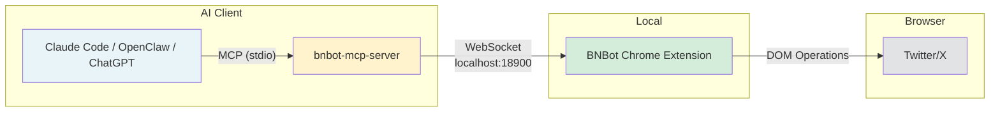

# BNBot Skill

The safest and most efficient way to automate Twitter/X — [BNBot](https://chromewebstore.google.com/detail/bnbot-your-ai-growth-agen/haammgigdkckogcgnbkigfleejpaiiln) operates through a real browser session with 28 AI-powered tools.

## Install

```bash
clawhub install bnbot
```

Or search for "bnbot" on [ClawHub](https://clawhub.ai/).

## Setup

1. Install the [BNBot Chrome Extension](https://chromewebstore.google.com/detail/bnbot-your-ai-growth-agen/haammgigdkckogcgnbkigfleejpaiiln)
2. Open [Twitter/X](https://x.com) in Chrome
3. Open the BNBot sidebar and enable **MCP** in Settings
4. Add the MCP server config to your AI client (the skill will show you the config and ask for your approval before any changes)

## Architecture



## What It Does

This skill lets your AI assistant control Twitter/X through 28 tools:

- **Post** tweets, threads, and long-form articles (with Markdown support)
- **Engage** — like, retweet, quote tweet, reply, follow
- **Scrape** timeline, bookmarks, search results, threads, and account analytics
- **Fetch content** from WeChat, TikTok, and Xiaohongshu for cross-platform repurposing
- **Navigate** Twitter pages (tweets, search, bookmarks, notifications)

All actions go through your real browser session — indistinguishable from manual human behavior, so your account stays safe.

## Requirements

- [BNBot Chrome Extension](https://chromewebstore.google.com/detail/bnbot-your-ai-growth-agen/haammgigdkckogcgnbkigfleejpaiiln) installed and MCP enabled
- Twitter/X open in Chrome
- [bnbot-mcp-server](https://www.npmjs.com/package/bnbot-mcp-server) configured in your AI client's MCP config

## Links

- [BNBot Chrome Extension](https://chromewebstore.google.com/detail/bnbot-your-ai-growth-agen/haammgigdkckogcgnbkigfleejpaiiln)
- [bnbot-mcp-server (npm)](https://www.npmjs.com/package/bnbot-mcp-server)
- [GitHub: bnbot-mcp-server](https://github.com/jackleeio/bnbot-mcp-server)
